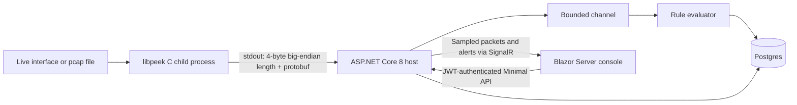

# PacketPeek

Status: in development

```mermaid
flowchart LR
    Source[Live interface or pcap file] --> C[libpeek C child process]
    C -->|stdout: 4-byte big-endian length + protobuf| Host[ASP.NET Core 8 host]
    Host --> Channel[Bounded channel]
    Channel --> Rules[Rule evaluator]
    Rules --> DB[(Postgres)]
    Host -->|Sampled packets and alerts via SignalR| UI[Blazor Server console]
    UI -->|JWT-authenticated Minimal API| Host
    Host --> DB
```
